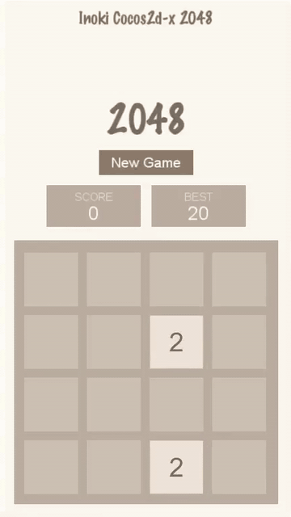
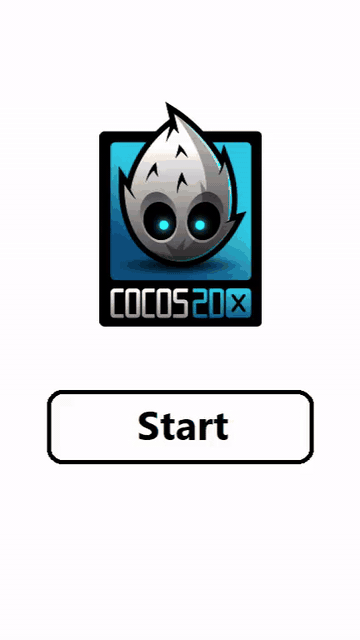

# Inoki Cocos2d-x 2048

A 2048 clone in C++ with [Cocos2d-x](https://github.com/cocos2d/cocos2d-x). Slide tiles, merge matching numbers, and try to reach 2048.



The title screen drops you onto a 4×4 board. Tiles ease into place, pop when they merge, and scale in when a new 2 or 4 appears.



## How to play

Swipe or use the keyboard to send every tile toward one side of the board. Equal tiles that collide combine into one tile with twice the value.

Empty cells in between still count as a valid merge:

- `[2, 0, 2, 0]` left → `[4, 0, 0, 0]`

A tile can merge only once per move, so a new value cannot chain immediately:

- `[4, 0, 2, 2]` left → `[4, 4, 0, 0]`
- next left → `[8, 0, 0, 0]`

A successful move then spawns a 2 (90%) or a 4 (10%). Score is the sum of merged values. Best score is saved locally. Reach 2048 to win; when no slide or merge is left, the game is over.

## Controls

| Input | Action |
| --- | --- |
| Arrow keys, WASD, or D-pad | Slide |
| Swipe | Slide |
| **New Game** / **Try Again** | Reset the board |
| **Continue** (after a win) | Keep playing |
| Close / Esc | Return to the title screen |

## Project layout

This repository is the game code and assets. Drop `Classes/` and `Resources/` into a Cocos2d-x cpp project (v3 or v4).

```
Classes/
  AppDelegate.*         Application bootstrap
  HelloWorldScene.*     Title screen
  Background2048.*      Board, input, sprites, HUD
  State2048.*           Move, merge, score, win / lose
Resources/
  squares.plist/.png    Tile sprite sheet (2 … 8192)
  fonts/                Marker Felt and Arial
```

`State2048` is engine-free C++ so the rules can be tested without running the scene.

## Building

Create a Cocos2d-x cpp template, copy `Classes/` and `Resources/` over the template copies, and add `Background2048.cpp` / `State2048.cpp` to the project `CMakeLists.txt` (or Xcode / Visual Studio target).

Linux desktop (Cocos2d-x v4) is a typical flow:

```bash
# after the engine is cloned and download-deps.py has been run
ln -s /path/to/cocos2d-x cocos2d
mkdir build && cd build
cmake .. -G Ninja -DCMAKE_BUILD_TYPE=Release
ninja
./bin/Game2048/Game2048
```

On newer glibc, prebuilt Chipmunk may need `__powf_finite` / `__expf_finite` stubs at link time. On Cocos2d-x v4, `KEY_BACK` is an alias of `KEY_ESCAPE`.
